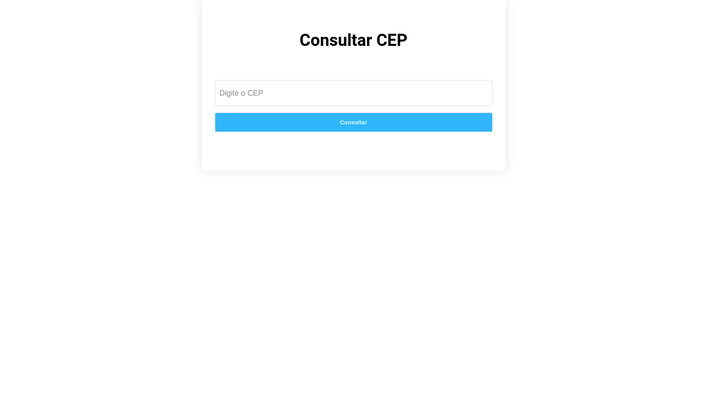

  

&#xa0;

<h1 align="center">CONSULTAR CEP</h1>

 

## :dart: About

Desenvolvi esse projeto para testar meus conhecimentos em JavaScript, neste projeto utilizei a API do CEPhttps://viacep.com.br/ para consultar o CEP.

## :rocket: Technologies

The following tools were used in this project:

- [HTML5](https://developer.mozilla.org/pt-BR/docs/Web/Guide/HTML/HTML5)
- [CSS3](https://developer.mozilla.org/pt-BR/docs/Web/CSS/CSS3)
- [JavaScript](https://developer.mozilla.org/pt-BR/docs/Web/JavaScript)

## :memo: License

This project is under license from MIT. For more details, see the [LICENSE](LICENSE.md) file.

Made with :heart: by <a href="https://github.com/luisfelipecode" target="_blank">Luis Felipe</a>
